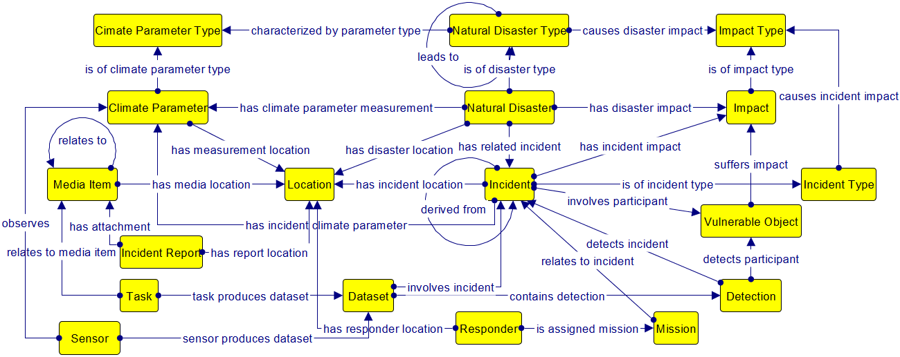
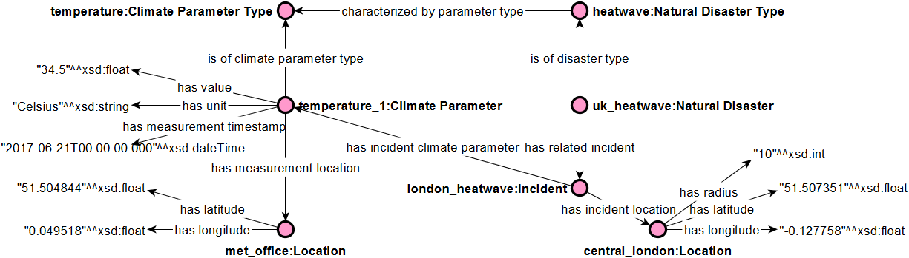
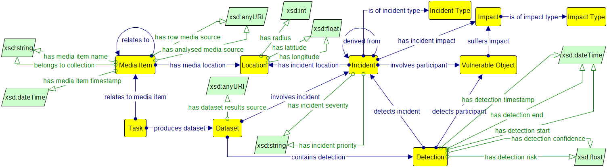
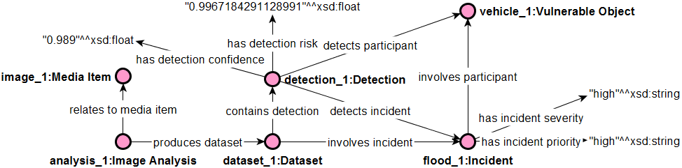
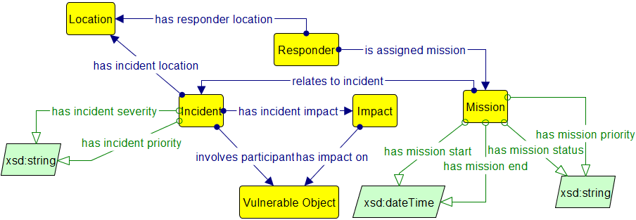

# The beAWARE Crisis Management Ontology
This repository contains the crisis management ontology for the [beAWARE H2020 project](http://beaware-project.eu/) along with the relevant documentation. 

# Table of Contents
* [Ontology Visualization](#ontology-visualization)
* [Ontology Scope](#ontology-scope)
  * [Representing Natural Disasters](#representing-natural-disasters)
  * [Representing Analyzed Data](#representing-analyzed-data)
  * [Representing Rescue Team Assignments](#representing-rescue-team-assignments) 
* [Reuse of Existing Resources](#reuse-of-existing-resources)
* [Ontology Specifications and Competency Questions](#ontology-specifications-and-competency-questions)
* [Citation](#citation)
* [Contact](#contact)
* [Acknowledgement](#acknowledgement)

## Ontology Visualization
All diagrammatic representations here are based on the [Grafoo](http://www.essepuntato.it/static/graffoo/specification/current.html) graphical notation. Alternatively, you can visualize the beAWARE ontology using [WebVOWL](http://vowl.visualdataweb.org/webvowl.html) by clicking [here](http://www.visualdataweb.de/webvowl/#iri=https://raw.githubusercontent.com/beAWARE-project/ontology/master/beAWARE_ontology.owl).

## Ontology Scope
The beAWARE ontology is an "all-around" lightweight crisis management ontology for climate-related natural disasters and represents the following key aspects:
* Information relevant to climate-related natural disasters;
* Analysis of data from multimodal sensors;
* Rescue team assignments.

The figure below displays an overview of the core ontology classes; for simplicity, data type and inverse properties are omitted, as well as extensive class hierarchies.

The following subsections present the various aspects of the ontology in more detail.

### Representing Natural Disasters
The representation of climate-related natural disasters in the beAWARE ontology is illustrated in the following figure.

Class `Natural Disaster Type` represents the various types of disasters, e.g. floods, forest fires, storms or earthquakes etc. Disasters may lead to other disasters (via property `leads to`); for instance, a heat wave may lead to forest fires, or storms may lead to floods. Each type of disaster is characterized by certain climate parameters, represented via class `Climate Parameter Type`. 

The actual manifestation of a natural disaster is represented via class `Natural Disaster`, an instance of which has specific climate conditions (via class `Climate Parameter`) with specific values. Impacts and incidents are also associated to natural disasters, via the respective classes. 

The figure below displays a sample temperature measurement, which was recorded during the [2017 UK heatwave](http://www.bbc.com/news/uk-40353118) (17-22 June).

### Representing Analyzed Data
The beAWARE ontology also encompasses information relevant to the analysis of input data coming from various sensors. The following figure illustrates the core constructs for representing the information fed to the ontology from the analysis components.

Class `Media Item` represents an item of analyzed data, which is related to some analysis task (via class `Task`). Media items can be pieces of text, images, videos, or social media posts, all of them submitted during the occurrence of the crisis. The analysis of the respective items (text analysis, image analysis or video analysis) produces a `Dataset` containing all relevant information (e.g. an object detection task may produce a dataset of detected incidents, objects, and confidence scores).

The figure below demonstrates an example of a video analysis instance, where a vehicle is detected participating in a flood incident. Note that the beAWARE ontology contains a complete typology of media items (text, image, video, social media), vulnerable objects (e.g. assets, stakeholders, infrastructure, buildings etc.), impacts, data analyses, and incidents.

### Representing Rescue Team Assignments
The third component of the beAWARE ontology is responsible for semantically representing rescue team assignments. The following figure displays the respective concepts in the proposed ontology. First responders (class `Responder`) are assigned one or more missions (class `Mission`), which in turn relate to incidents that involve participating entities (class `Vulnerable Object`). A mission is also characterized by start and end time, status and mission priority.

## Reuse of Existing Resources

The beAWARE ontology imports the Simple Knowledge Organization System ([SKOS](https://www.w3.org/TR/2009/REC-skos-reference-20090818/)), which provides a set of metadata fields for enriching the ontology documentation. Specifically, we used `skos:definition` for providing the definitions of the classes and properties, and `skos:example` for providing examples of usage.

Moreover, we relied on previously used and validated ontologies for developing (parts of) our ontology:
* The [PESCaDO ontologies](https://link.springer.com/chapter/10.1007/978-3-642-37996-3_16) were used as the basis for representing environmental and meteorological conditions;
* The representation of disaster impacts was to some extend based on [MOAC](http://www.observedchange.com/moac/ns/) (Management of a Crisis Vocabulary);
* For categorizing damages and resources we are based on [SoKNOS](https://link.springer.com/chapter/10.1007/978-3-642-21064-8_13);
* With regards to rescue unit assignments, our adopted representation is based on the approach proposed by the [OASIS project](https://cordis.europa.eu/project/rcn/92923_en.html).

## Ontology Specifications and Competency Questions

The full list of the ontology specs can be found [here](beAWARE_Ontology_Specifications.pdf), while an indicative list of Competency Questions (CQs) that the ontology can respond to are found [here](beAWARE_Competency_Questions.md).

## Citation

Please cite the following paper when using the beAWARE ontology:

> Kontopoulos, E., Mitzias, P., Moßgraber, J., Hertweck, P., van der Schaaf, H., Hilbring, D., Lombardo, F., Norbiato, D., Ferri, M., Karakostas, A., Vrochidis, S., and Kompatsiaris, I. (2018). [Ontology-based Representation of Crisis Management Procedures for Climate Events](https://zenodo.org/record/1243535). 1st International Workshop on Intelligent Crisis Management Technologies for Climate Events (ICMT 2018), Rochester NY, USA, 20 May 2018. 

## Contact
For any queries or remarks, please feel free to contact us:
* Efstratios (Stratos) Kontopoulos ([Homepage](http://www.stratoskontopoulos.com) | [e-mail](mailto:skontopo@iti.gr?subject=beAWARE%20ontology) | [GitHub account](https://github.com/skontopo))
* Panagiotis Mitzias ([Homepage](http://pmitzias.com/) | [e-mail](mailto:pmitzias@iti.gr?subject=beAWARE%20ontology) | [GitHub account](https://github.com/panmitz))
* Jürgen Moßgraber ([e-mail](mailto:juergen.mossgraber@iosb.fraunhofer.de?subject=beAWARE%20ontology))
* Tobias Hellmund ([e-mail](mailto:tobias.hellmund@iosb.fraunhofer.de?subject=beAWARE%20ontology))

## Acknowledgement
This project has received funding from the European Union's Horizon 2020 research and innovation programme under grant agreement No 700475.
