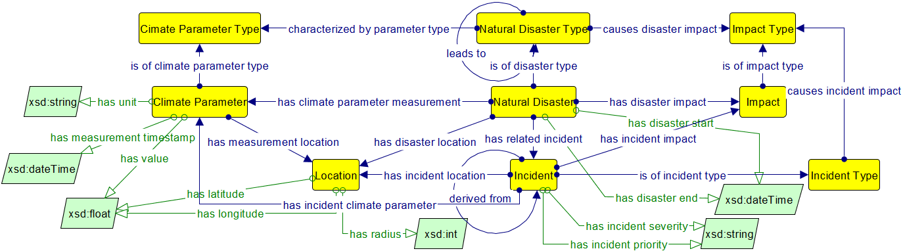

# beAWARE Ontology
This repository contains the first iteration of the beAWARE ontology, which was presented in project deliverable D4.2.

## Ontology Scope
The beAWARE ontology is an "all-around" lightweight ontology for climate crisis management and represents the following key aspects:
* Climate-related natural disasters;
* Analysis of data from the multimodal sensors;
* Rescue team assignments.

The figure below displays an overview of the core ontology classes; for simplicity, we have omitted data type and inverse properties, as well as extensive class hierarchies.

The following subsections present the various aspects of the ontology in more detail.

### Representing Natural Disasters
The representation of climate-related natural disasters in the beAWARE ontology is illustrated in the following figure.

Class `Natural Disaster Type` represents the various types of disasters, e.g. floods, forest fires, storms or earthquakes etc. Disasters may lead to other disasters (via property `leads to`); for instance, a heat wave may lead to forest fires, or storms may lead to floods. Each type of disaster is characterized by certain climate parameters, represented via class `Climate Parameter Type`. The actual manifestation of a natural disaster is represented via class `Natural Disaster`, an instance of which has specific climate conditions (via class `Climate Parameter`) with specific values. Impacts and incidents are also associated to natural disasters, via the respective classes. 

Figure 4 displays a sample temperature measurement, which was recorded during the 2017 UK heatwave  (17-22 June).

## Citation

Please cite the following paper when using the beAWARE ontology:

> Kontopoulos, E., Mitzias, P., Moßgraber, J., Hertweck, P., van der Schaaf, H., Hilbring, D., Lombardo, F., Norbiato, D., Ferri, M., Karakostas, A., Vrochidis, S., and Kompatsiaris, I. (2018). [Ontology-based Representation of Crisis Management Procedures for Climate Events](https://zenodo.org/record/1243535). 1st International Workshop on Intelligent Crisis Management Technologies for Climate Events (ICMT 2018), Rochester NY, USA, 20 May 2018. 
